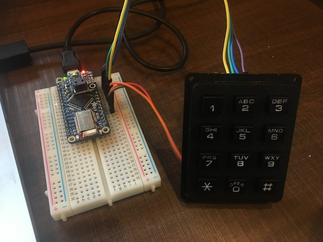
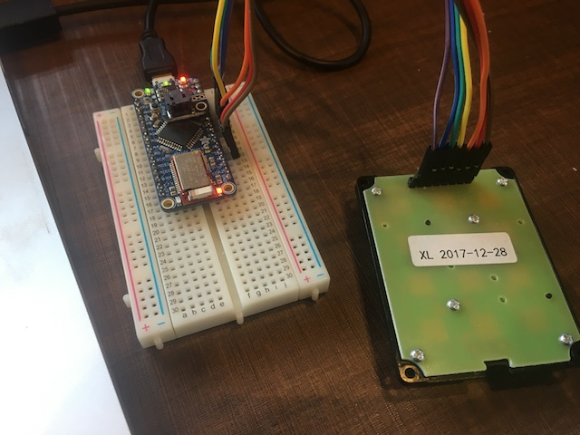

# Bluetoothキーパッド

## 概要
Adafruit社のBluefruit LE Microと3x4キーパッドを使ったHIDコントローラー。
- ニューメリックモード（標準）は「０」から「９」までのキーコードを送信
- 「＊」押し下げ後アルファベットモードで「a」から「j」までのキーコードを送信（３秒後にモード解除）
- 「＃」押し下げ後はコントールキーモードになり、「２」が音量アップ、「８」が音量ダウン、「４」が音楽プレイヤーの前の曲へ、「５」が音楽プレイヤーの再生・停止、「６」が音楽プレイヤーの次の曲へ、「１」が画面の明るさアップ、「３」が画面の明るさダウン。（３秒後にモード解除）

## ピンアサイン

キーパッドのキー面を上にした状態で左から３つのピンが列認識ピン、４つ目から４つのピンが行認識ピン。一番右のピンは使用しない。

Bluefruit LE Microへの接続は、列認識ピンは左からデジタルI/Oピンの＃５、＃６、＃９に接続、行認識ピンは左からデジタルI/Oピンの＃１０、＃１１、＃１２、＃１３に接続。
